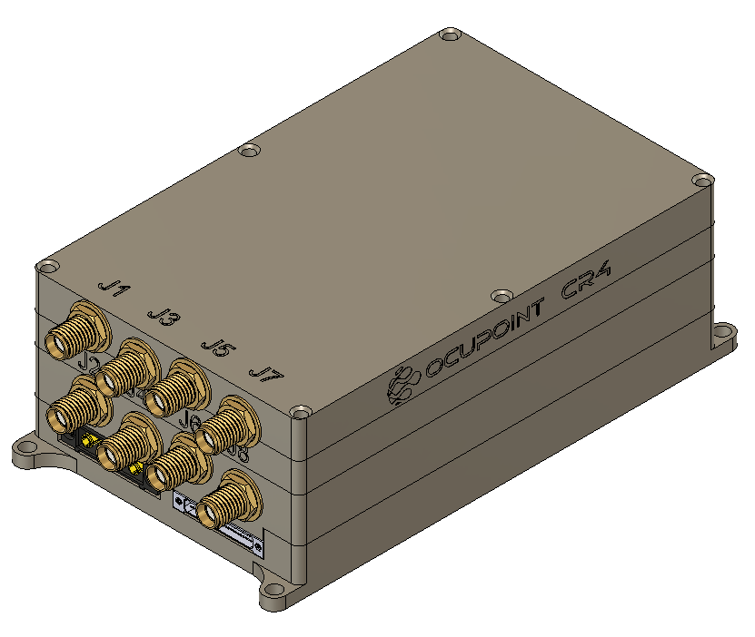

# CR4 V4 R5 Application Note
## Clock Select & Lock Detection

## Overview

This application note provides detailed information about the CR4 V4 R5 hardware, focusing on the Omnetics connector interface and the updated features related to clock selection and PLL lock detection.

## Omnetics Connector Interface

The Omnetics connector interface on the CR4 V4 R5 supports 1.8V logic levels, ensuring compatibility with low-voltage logic devices.

### Clock Select Feature

A discrete pin for clock selection has been introduced on pin A23 of the Omnetics connector. This pin, labeled **CLCK_SELECT**, allows the user to toggle between the internal and external clock sources:

- **CLCK_SELECT High**: The system uses the internal clock.
- **CLCK_SELECT Low**: The system switches to the external clock. Connect a differential clock signal on pins A50 and A51

**Note**: Switching to the external clock automatically disables the internal clock to prevent any conflicts or interference.

## PLL Lock Detection

The CR4 V4 R5 features two pins, **PLL_LOCK_AB** and **PLL_LOCK_CD**, which provide signals for detecting the lock status of the Phase-Locked Loops (PLLs). These pins are tied to pairs of PLLs:

- **PLL_LOCK_AB**: Indicates the lock status for both PLL A and PLL B.
- **PLL_LOCK_CD**: Indicates the lock status for both PLL C and PLL D.

**Note**: When either **PLL_LOCK_AB** or **PLL_LOCK_CD** is asserted, it indicates that at least one of the paired PLLs is locked. However, it does not specify which PLL within the pair (A or B, C or D) is locked.

## LED Indicators

- **CLCK_SELECT**: Indicates whether the internal or external clock is selected.
- **PLL_LOCK_AB**: Shows the lock status for PLL A and B.
- **PLL_LOCK_CD**: Shows the lock status for PLL C and D.

These LEDs allow for quick diagnostics and status checks during operation.

## Full Pinout Information

For a comprehensive view of all pin assignments and detailed mechanical specifications, please refer to the full pinout provided in the mechanical ICD, **"CR4_V4_R5_Mechanical_ICD.pdf"**.